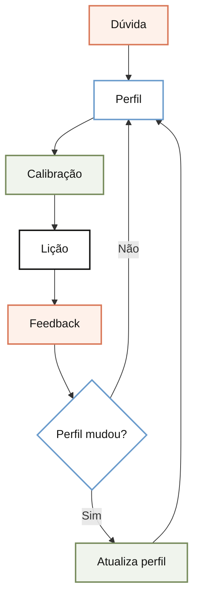

# Como o Doceo usa o _profile.md, em uma frase

O _profile.md funciona como a ficha de calibragem do Doceo: mostra quem está aprendendo, o que já sabe e como prefere receber uma explicação.

## Imagem

<!-- diagram:como-o-doceo-usa-o-profile:start -->

<!-- diagram:como-o-doceo-usa-o-profile:end -->

O perfil orienta a lição. Ele só muda quando surge uma informação confirmada sobre conhecimento, lacuna ou preferência.

## Analogia

Pense no _profile.md como o briefing de um cliente antes de uma reunião de produto. Você consulta o contexto para não começar do zero, mas só altera o briefing quando uma informação foi confirmada, não a cada frase da conversa.

## Onde isso se encaixa

Antes de explicar, o Doceo consulta o perfil para escolher a altitude da conversa. No seu caso, ele pode partir de produtos, negócios e engenharia, mas não deve presumir domínio operacional de toda biblioteca ou ferramenta web.

O perfil é contexto relativamente estável. As regras aprendidas e o feedback registram ajustes mais frequentes sobre como ensinar.

## Como funciona

1. **Contexto:** lê papel, domínios conhecidos e preferências.  
   **Pronto quando:** sabe o ponto de partida do leitor.
2. **Calibragem:** escolhe linguagem, profundidade e exemplo.  
   **Pronto quando:** a explicação tem a altitude certa.
3. **Lição:** entrega resposta, imagem mental, analogia e aplicação.  
   **Pronto quando:** o leitor entende sem reler.
4. **Atualização:** muda o perfil somente com evidência confirmada.  
   **Pronto quando:** a nova informação é uma regra confiável, não um palpite.

## Verifique se entendeu

O que o _profile.md calibra?

A linguagem, a profundidade, os exemplos e o ponto de partida da explicação.

Por que ele não deve mudar a cada pergunta?

Porque uma pergunta mostra uma necessidade pontual. O perfil só deve registrar uma mudança confirmada sobre conhecimento, lacuna ou preferência.

## Vá além

- [Perfil de aprendizagem](../_profile.md)
- [Regras acumuladas do Doceo](../_learnings.md)
- [O que é o Doceo](2026-07-11%20-%20o-que-e-o-doceo.md)
- [Mapa de ferramentas de conhecimento](../maps/ferramentas-de-conhecimento.md)

## Próximas lições

- Como o feedback atualiza _learnings.md.
- Como uma lição é armazenada em OKF.
- Como o índice conecta lições.

## Citações

- [Repositório do Doceo](https://github.com/eugeniughelbur/doceo)
