# Como o GitHub renderiza Mermaid, em uma frase

O GitHub reconhece um bloco Markdown marcado como `mermaid`, passa sua definição para a integração do Mermaid e exibe o resultado como um diagrama na página.

## Imagem

```mermaid
flowchart LR
    bloco["Bloco Mermaid"]
    github["GitHub reconhece"]
    mermaid["Mermaid interpreta"]
    visual["Diagrama visual"]
    leitor["Leitor vê"]
    bloco --> github
    github --> mermaid
    mermaid --> visual
    visual --> leitor
    classDef coral fill:#FEF1EA,stroke:#D97757,color:#141413,stroke-width:2px
    classDef blue fill:#FFFFFF,stroke:#6A9BCC,color:#141413,stroke-width:2px
    classDef green fill:#F0F4ED,stroke:#788C5D,color:#141413,stroke-width:2px
    classDef ink fill:#FFFFFF,stroke:#141413,color:#141413,stroke-width:2px
    class bloco coral
    class github blue
    class mermaid green
    class visual ink
    class leitor coral
```

<!-- diagram:github-renderiza-mermaid:start -->

<!-- diagram:github-renderiza-mermaid:end -->

## Analogia

Pense em um briefing de produto: você entrega uma especificação textual, o time de design a interpreta e o cliente recebe uma tela pronta. No GitHub, o bloco Mermaid é o briefing, a biblioteca é o intérprete e o diagrama é a tela.

## Onde isso se encaixa

O GitHub tem essa integração dentro do seu renderizador de Markdown. Por isso, o mesmo tipo de bloco pode aparecer em README, Issues, Pull Requests, Discussions, Wikis e arquivos Markdown compatíveis.

O ponto importante é separar fonte e apresentação: o repositório guarda texto fácil de versionar, enquanto o leitor vê o fluxo. Fora do GitHub, um HTML precisa carregar Mermaid ou receber um SVG gerado durante a build.

## Passos essenciais

1. Escreva o fluxo em texto.
   **Pronto quando:** a definição começa com uma instrução Mermaid válida.
2. Use o identificador `mermaid` na cerca de código.
   **Pronto quando:** o bloco começa com ` ```mermaid ` e termina com três crases.
3. Publique em uma área Markdown suportada pelo GitHub.
   **Pronto quando:** a visualização mostra o desenho, não apenas o texto.

## Verifique se entendeu

<details>
<summary>O que faz o GitHub diferenciar Mermaid de um bloco de código comum?</summary>

O identificador de linguagem `mermaid` e o suporte específico do renderizador de Markdown.
</details>

<details>
<summary>O arquivo precisa guardar uma imagem do diagrama?</summary>

Não. A definição textual pode ser versionada e o GitHub gera a apresentação visual ao renderizar a página.
</details>

## Vá além

- [GitHub: criando diagramas](https://docs.github.com/en/get-started/writing-on-github/working-with-advanced-formatting/creating-diagrams)
- [Mermaid: repositório e documentação](https://github.com/mermaid-js/mermaid)

## Próximas lições

- Como a Mermaid vira SVG durante uma build.
- Quando usar Mermaid no Markdown e SVG estático no HTML.

## Citações

- [GitHub Docs: Creating diagrams](https://docs.github.com/en/get-started/writing-on-github/working-with-advanced-formatting/creating-diagrams)
- [Mermaid: repositório oficial](https://github.com/mermaid-js/mermaid)
