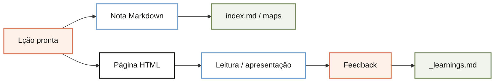

# Como uma lição vira nota Markdown e página HTML

A mesma lição gera dois artefatos: a nota Markdown guarda a memória do conhecimento e a página HTML publica a leitura.

## Imagem

<!-- diagram:como-uma-licao-vira-nota-markdown-e-pagina-html:start -->

<!-- diagram:como-uma-licao-vira-nota-markdown-e-pagina-html:end -->

## Analogia

Pense como uma release de produto: o Markdown é o changelog interno, e o HTML é a apresentação que você mostra para cliente ou time.

## Onde isso se encaixa

O Doceo não responde e some. Ele transforma a resposta em um artefato que pode ser retomado depois. O Markdown preserva o conteúdo para memória e conexão com o índice. O HTML organiza a mesma ideia para leitura rápida, apresentação e compartilhamento.

Isso importa porque o conhecimento só vira reuso quando fica navegável. Se a lição não gera uma nota clara e uma página legível, ela continua presa na conversa.

## Passos

1. Escrever a lição em Markdown. Pronto quando a ideia cabe em uma nota buscável.
2. Atualizar o índice e o mapa do domínio. Pronto quando a lição deixa de ficar isolada.
3. Gerar a página HTML. Pronto quando alguém entende sem abrir o editor.
4. Registrar o feedback. Pronto quando a próxima versão sabe o que melhorar.

## Verifique se entendeu

Qual artefato guarda a memória?

A nota Markdown.

Qual artefato serve para leitura e apresentação?

A página HTML.

## Vá além

- [O que é o Doceo](2026-07-11%20-%20o-que-e-o-doceo.md)
- [Como o Doceo usa o _profile.md](2026-07-11%20-%20como-o-doceo-usa-o-profile.md)
- [Regras acumuladas do Doceo](../_learnings.md)
- [Checklist operacional do Doceo](../docs/checklist-operacional.md)

## Próximas lições

- Como o feedback atualiza _learnings.md.
- Como uma lição é armazenada em OKF.
- Como o índice conecta lições.
