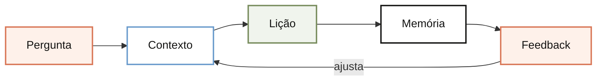

# O que é o Doceo, em uma frase

Doceo é uma skill que transforma uma dúvida em uma lição curta, visual e reutilizável, calibrada pelo que você já sabe e melhorada pelo seu feedback.

## Imagem

<!-- diagram:o-que-e-o-doceo:start -->

<!-- diagram:o-que-e-o-doceo:end -->

## Analogia

Pense no Doceo como um gerente de produto que também sabe ensinar. Ele entende o problema, consulta o contexto, entrega uma primeira versão útil e usa o feedback para melhorar a próxima versão.

## Onde isso se encaixa

Um chatbot pode responder e encerrar. O Doceo transforma a resposta em um artefato publicável: uma nota Markdown para a memória e uma página HTML para leitura ou apresentação.

Antes de escrever, ele consulta seu perfil, as regras aprendidas, o índice e o mapa do domínio. Assim, a explicação parte do que você já conhece e a base cresce sem virar um arquivo de respostas soltas.

## Como funciona

1. **Entrada:** você informa um tema, arquivo, URL ou dúvida.  
   **Pronto quando:** existe uma pergunta clara para ensinar.
2. **Calibração:** o Doceo escolhe a profundidade e as analogias adequadas.  
   **Pronto quando:** a explicação tem um leitor definido.
3. **Lição:** ele entrega resposta, imagem mental, analogia e aplicação.  
   **Pronto quando:** o leitor consegue entender sem reler.
4. **Memória:** salva a nota, atualiza o índice e aprende com o feedback.  
   **Pronto quando:** a próxima lição pode começar desse ponto.

## Verifique se entendeu

O que diferencia o Doceo de uma resposta isolada?

Ele registra a lição e a conecta ao conhecimento anterior.

Qual é o papel do feedback?

Corrigir a lição atual e transformar preferências repetidas em regras de ensino.

## Vá além

- [Seu perfil de aprendizagem](../_profile.md)
- [Mapa de ferramentas de conhecimento](../maps/ferramentas-de-conhecimento.md)
- [Repositório do Doceo](https://github.com/eugeniughelbur/doceo)

## Próximas lições

- Como o Doceo usa o _profile.md.
- Como uma lição vira nota Markdown e página HTML.
- Como o feedback atualiza _learnings.md.

## Citações

- [Repositório do Doceo](https://github.com/eugeniughelbur/doceo)
