# Como renderizar Mermaid no navegador, em uma frase

O HTML carrega a biblioteca Mermaid, encontra um bloco `pre.mermaid` e o substitui por um SVG durante a execução da página.

## Imagem

```mermaid
flowchart LR
    bloco["Bloco Mermaid"]
    github["GitHub reconhece"]
    mermaid["Mermaid interpreta"]
    visual["Diagrama visual"]
    leitor["Leitor vê"]
    bloco --> github
    github --> mermaid
    mermaid --> visual
    visual --> leitor
    classDef coral fill:#FEF1EA,stroke:#D97757,color:#141413,stroke-width:2px
    classDef blue fill:#FFFFFF,stroke:#6A9BCC,color:#141413,stroke-width:2px
    classDef green fill:#F0F4ED,stroke:#788C5D,color:#141413,stroke-width:2px
    classDef ink fill:#FFFFFF,stroke:#141413,color:#141413,stroke-width:2px
    class bloco coral
    class github blue
    class mermaid green
    class visual ink
    class leitor coral
```

## Analogia

É como uma aplicação web que busca um componente quando abre: o HTML chega com a instrução e a biblioteca entra em cena no momento do uso. O desenho nasce na visita, não durante a build.

## Onde isso se encaixa

Esta abordagem é útil para playgrounds, documentação interativa e páginas em que o diagrama pode mudar após o carregamento. Ela torna visível o mecanismo que o GitHub esconde na experiência final.

O custo é depender de rede, JavaScript e de uma versão externa da biblioteca. Para publicação estável ou offline, o SVG gerado na build continua sendo mais previsível.

## Passos essenciais

1. Inclua um bloco `pre.mermaid`.
   **Pronto quando:** o HTML contém a definição textual.
2. Importe Mermaid como módulo.
   **Pronto quando:** a biblioteca pode ser carregada pela CDN.
3. Inicialize e execute `mermaid.run()`.
   **Pronto quando:** o texto é substituído por um SVG no DOM.

## Verifique se entendeu

O que muda em relação ao SVG estático?

O navegador executa Mermaid e gera o desenho depois que a página é carregada.

Qual é o principal risco dessa alternativa?

A página depende da rede, do JavaScript e da disponibilidade da versão carregada da biblioteca.

## Vá além

- [Mermaid: uso no navegador](https://mermaid.js.org/config/usage.html)
- [GitHub: criando diagramas](https://docs.github.com/en/get-started/writing-on-github/working-with-advanced-formatting/creating-diagrams)

## Próximas lições

- Como testar fallback quando a CDN está indisponível.
- Como trocar a CDN por Mermaid empacotado localmente.

## Citações

- [Mermaid: Usage](https://mermaid.js.org/config/usage.html)
- [Mermaid: About](https://mermaid.js.org/intro/)
- [GitHub Docs: Creating diagrams](https://docs.github.com/en/get-started/writing-on-github/working-with-advanced-formatting/creating-diagrams)
