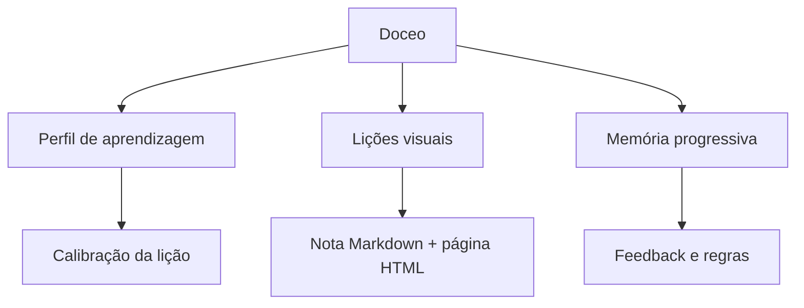

# Mapa de ferramentas de conhecimento

## Lições do domínio

- [O que é o Doceo](../lessons/2026-07-11%20-%20o-que-e-o-doceo.md) - como perguntas viram lições visuais e memória progressiva.

- [Como o Doceo usa o _profile.md](../lessons/2026-07-11%20-%20como-o-doceo-usa-o-profile.md) - como o perfil calibra a linguagem, a profundidade e os exemplos.

- [Como uma li??o vira nota Markdown e p?gina HTML](../lessons/2026-07-11%20-%20como-uma-licao-vira-nota-markdown-e-pagina-html.md) - como o Doceo separa mem?ria e publica??o a partir da mesma li??o.

## Próximos conceitos

- Como o feedback atualiza _learnings.md.
- Como uma lição é armazenada em OKF.
- Como feedback repetido vira regra de aprendizagem.

## Citações

- [Repositório do Doceo](https://github.com/eugeniughelbur/doceo)
